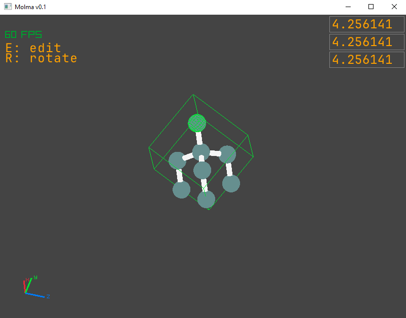

# Molma

Molma is a molecule editor/visualizer program for [POSCAR](https://www.vasp.at/wiki/POSCAR) files.

The goal is to be able to easily design molecules for VASP based simulation studies.

## Screenshot


## Status

This is very much alpha software!
This software is under heavy development, so please have patience.
Please report any issues you come across.

## Build
```bash
odin build .
```

## License
Licensed under Apache-2.0

## Citation
see `CITATION.cff`

## Thirdparty Notices
- This application distributes the JetBrainsMono font, licensed under the SIL Open Font License 1.1.
- This application uses the [nativefiledialog-odin](https://github.com/ivansouzamf/nativefiledialog-odin) library
    - This library is based on and distributes binaries and wrappers for the original [nativefiledialog-extended](https://github.com/btzy/nativefiledialog-extended) library

